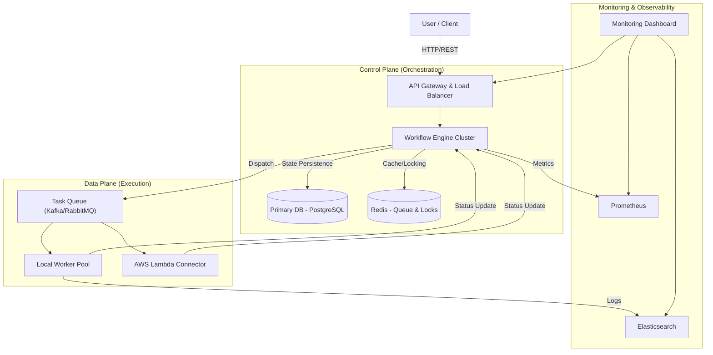
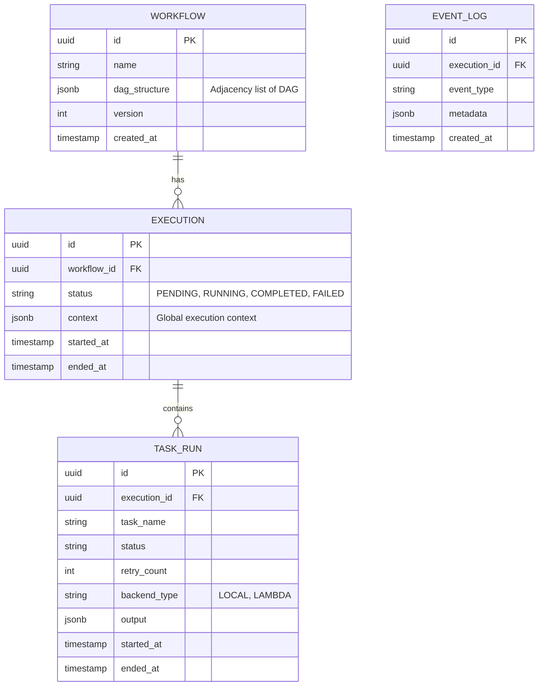

# High-Level Architecture Design

## 1. System Architecture

The system is designed as a distributed, horizontally scalable workflow orchestration engine. It separates the **Control Plane** (Orchestration) from the **Data Plane** (Execution) to ensure high availability and scalability.

### Architecture Diagram

### Components
1.  **Workflow Engine (Orchestrator)**:
    -   **Role**: Manages the state of DAGs, handles scheduling, dependency resolution, and task dispatching.
    -   **Design**: Stateless services that acquire distributed locks (via Redis) on specific workflows to process them. This allows horizontal scaling.
2.  **Task Queue**:
    -   **Role**: Decouples scheduling from execution.
    -   **Design**: Multi-topic queue (e.g., Kafka or Redis Streams) to handle high throughput (10,000+ concurrent workflows).
3.  **Execution Backends**:
    -   **Local Thread Pool**: Long-running containerized workers for synchronous/CPU-bound tasks.
    -   **AWS Lambda**: Serverless invocation for short-lived, bursty tasks.
4.  **Persistence Layer**:
    -   **PostgreSQL**: Stores relational data (Workflow definitions, Execution history).
    -   **Redis**: Hot storage for active execution state, distributed locks, and rapid counter increments.

---

## 2. Database Schema Design

The database needs to handle high write throughput for state transitions. We use **PostgreSQL** for strict consistency.

### Schema Diagram (ERD)

### Key Optimizations for Scaling
1.  **Partitioning**: `EXECUTION` and `TASK_RUN` tables are partitioned by `started_at` (Timeline Partitioning) to handle the 10,000+ workflow scale.
2.  **JSONB**: Used for `dag_structure` and `context` to allow flexible schema changes without migration capability downtime.
3.  **Indexes**: Compound indexes on `(execution_id, status)` for rapid lookup of active tasks.

---

## 3. Scaling Strategy

### Handle 10,000 Concurrent Workflows
1.  **Horizontal Sharding of Orchestrators**:
    -   The Orchestrator Engine is sharded using **Consistent Hashing** on the `WorkflowExecutionID`.
    -   This ensures that all events for Workflow `A` are processed by Node `1`, reducing lock contention in the DB.
2.  **Read Replicas**:
    -   The Dashboard reads solely from Read Replicas of the PostgreSQL DB to avoid impacting write performance of the core engine.
3.  **Execution Plane**:
    -   **Local**: Use Kubernetes HPA (Horizontal Pod Autoscaler) based on Queue Depth (lag).
    -   **Lambda**: Naturally scalable, but limited by AWS Account Concurrency Quotas (needs proactive quota increase).

### Handle 1,000 Tasks per Workflow
1.  **Lazy Loading**: The core engine does not load the entire execution history into memory. It only loads the *Frontier* (currently executable tasks).
2.  **Batch Updates**: Status updates from workers are batched (e.g., every 100ms or 50 tasks) before being written to PostgreSQL to reduce IOPS.

---

## 4. Failure Recovery & Reliability

### Engine Failure (High Availability)
-   **Leader Election / Leasing**: Each Orchestrator instance leases a shard of workflows. If an instance fails to renew its lease (heartbeat missing in Redis for 30s), a standby node takes over ownership of those workflows.
-   **At-Least-Once Delivery**: The Task Queue ensures tasks are not ack'd until completion. If a worker dies, the visibility timeout expires, and the task is redelivered.

### Task Failure & Retries
-   **Exponential Backoff**:
    -   Implemented in the Dispatcher.
    -   Formula: `WaitTime = Base * (Multiplier ^ RetryCount)`.
    -   Example: 2s, 4s, 8s, 16s...
-   **Dead Letter Queue (DLQ)**: After `MaxRetries` (e.g., 5), the task is moved to a DLQ for manual inspection, and the workflow is paused (or failed based on policy).

### Network Partitions
-   **Idempotency Keys**: Every task dispatch includes a unique UUID. Backends (Lambda/Local) track processed UUIDs to prevent double-execution during network blips where acknowledgments are lost.

---

## 5. API Design Choices

### API Style: **REST (State Representational State Transfer)**
We chose REST over gRPC or GraphQL for the Control Plane level.

1.  **Resource Orientation**: Workflows and Executions map naturally to resources (e.g., `POST /workflows`, `GET /executions/{id}`).
2.  **Cacheability**: HTTP caching can be leveraged for static resources like Workflow Definitions (`GET /workflows/def/{version}`).
3.  **Ecosystem**: Simpler integration for third-party webhooks (e.g., GitHub Actions triggering a workflow) compared to gRPC.

### Real-Time Updates: **WebSockets**
For the monitoring dashboard, REST polling is inefficient. We use **WebSockets** for:
-   Pushing `TaskStarted`, `TaskCompleted` events instantly to the UI.
-   Reducing load on the database by broadcasting memory-state changes directly from the Orchestrator (via Redis Pub/Sub bridge).

---

## 6. Security Considerations

### Authentication & Authorization
-   **OAuth2 / OpenID Connect**: Integration with corporate identity providers (Google/Okta) to ensure only authorized personnel can access the Control Plane.
-   **RBAC (Role-Based Access Control)**:
    -   **Viewer**: Can view Dashboards and Logs (Read-Only).
    -   **Operator**: Can `Trigger`, `Pause`, `Resume` workflows.
    -   **Admin**: Can `Create`/`Delete` workflow definitions and manage secrets.

### Injection Prevention
-   **Input Sanitization**: All workflow inputs (JSON payloads) are validated against a strict JSON Schema defined in the Workflow Definition before execution starts.
-   **Code Execution Sandboxing**:
    -   Python Tasks usually run Arbitrary Code.
    -   **Mitigation**: Use **gVisor** or **Firecracker MicroVMs** for the Local Worker Pool to ensure task isolation.
    -   **Secrets Management**: Never pass secrets as raw environment variables. Use a vault (e.g., AWS Secrets Manager, HashiCorp Vault) and inject them only into the process memory at runtime.

---

## 7. Core Design Decisions & Trade-offs

To explicitly address the rationale behind our architecture, here are the key trade-offs we navigated:

1.  **Control/Data Plane Separation vs. Monolith**:
    -   **Decision**: Decouple logic (Control) from compute (Data).
    -   **Rationale**: Allows the engine to remain lightweight and highly responsive. Heavy data tasks running in the `Local Worker Pool` will never block the heartbeat loop of the orchestrator.
    -   **Trade-off**: Increases operational complexity (managing two services) but required for high scalability.

2.  **PostgreSQL (Relational) vs. NoSQL (DynamoDB/Cassandra)**:
    -   **Decision**: Use PostgreSQL for primary metadata storage.
    -   **Rationale**: Workflow state transitions require strict ACID compliance. An inconsistent read (e.g., seeing a task as "Pending" when it's actually "Running") could lead to double-execution.
    -   **Trade-off**: Lower raw write throughput than Cassandra. Addressed by **Partitioning** and **Batching**.

3.  **WebSockets vs. Long-Polling**:
    -   **Decision**: Use WebSockets for Dashboard updates.
    -   **Rationale**: Real-time visibility is critical for Ops teams responding to incidents. Polling at 10k workflows would DDOS our own database.
    -   **Trade-off**: Requires stateful connection management at the API Gateway layer (which can be hard to auto-scale), but justified by DB load reduction.

4.  **JSONB for Schema vs. Pure Relational Columns**:
    -   **Decision**: Store DAG structure and Context as JSONB.
    -   **Rationale**: Workflow definitions change frequently. Supporting custom parameters for new Task types without running `ALTER TABLE` migrations allows for rapid iteration and extensibility.
    -   **Trade-off**: Slightly slower queries on nested fields, but mitigated by GIN indexing where necessary.
