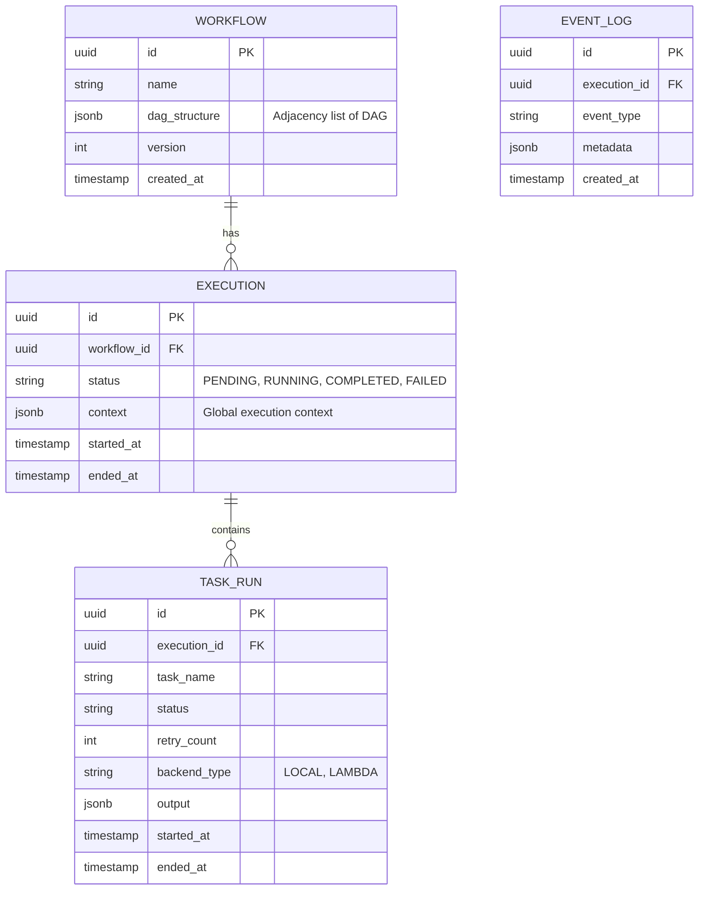

# High-Level Architecture Design

## 1. System Architecture

The system is designed as a distributed, horizontally scalable workflow orchestration engine. It separates the **Control Plane** (Orchestration) from the **Data Plane** (Execution) to ensure high availability and scalability.

### Architecture Diagram

```mermaid
graph TD
    User[User / Client] -->|HTTP/REST| API[API Gateway & Load Balancer]
    
    subgraph "Control Plane (Orchestration)"
        API --> EngineCluster[Workflow Engine Cluster]
        EngineCluster -->|State Persistence| DB[(Primary DB - PostgreSQL)]
        EngineCluster -->|Cache/Locking| Redis[(Redis - Queue & Locks)]
    end
    
    subgraph "Data Plane (Execution)"
        EngineCluster -->|Dispatch| Queue[Task Queue (Kafka/RabbitMQ)]
        
        Queue --> WorkerPool[Local Worker Pool]
        Queue --> LambdaConn[AWS Lambda Connector]
        
        WorkerPool -->|Status Update| EngineCluster
        LambdaConn -->|Status Update| EngineCluster
    end
    
    subgraph "Monitoring & Observability"
        EngineCluster -->|Metrics| Prometheus
        WorkerPool -->|Logs| Elasticsearch
        Dashboard[Monitoring Dashboard] --> Prometheus
        Dashboard --> Elasticsearch
        Dashboard --> API
    end
```

### Components
1.  **Workflow Engine (Orchestrator)**:
    -   **Role**: Manages the state of DAGs, handles scheduling, dependency resolution, and task dispatching.
    -   **Design**: Stateless services that acquire distributed locks (via Redis) on specific workflows to process them. This allows horizontal scaling.
2.  **Task Queue**:
    -   **Role**: Decouples scheduling from execution.
    -   **Design**: Multi-topic queue (e.g., Kafka or Redis Streams) to handle high throughput (10,000+ concurrent workflows).
3.  **Execution Backends**:
    -   **Local Thread Pool**: Long-running containerized workers for synchronous/CPU-bound tasks.
    -   **AWS Lambda**: Serverless invocation for short-lived, bursty tasks.
4.  **Persistence Layer**:
    -   **PostgreSQL**: Stores relational data (Workflow definitions, Execution history).
    -   **Redis**: Hot storage for active execution state, distributed locks, and rapid counter increments.

---

## 2. Database Schema Design

The database needs to handle high write throughput for state transitions. We use **PostgreSQL** for strict consistency.

### Schema Diagram (ERD)



### Key Optimizations for Scaling
1.  **Partitioning**: `EXECUTION` and `TASK_RUN` tables are partitioned by `started_at` (Timeline Partitioning) to handle the 10,000+ workflow scale.
2.  **JSONB**: Used for `dag_structure` and `context` to allow flexible schema changes without migration capability downtime.
3.  **Indexes**: Compound indexes on `(execution_id, status)` for rapid lookup of active tasks.

---

## 3. Scaling Strategy

### Handle 10,000 Concurrent Workflows
1.  **Horizontal Sharding of Orchestrators**:
    -   The Orchestrator Engine is sharded using **Consistent Hashing** on the `WorkflowExecutionID`.
    -   This ensures that all events for Workflow `A` are processed by Node `1`, reducing lock contention in the DB.
2.  **Read Replicas**:
    -   The Dashboard reads solely from Read Replicas of the PostgreSQL DB to avoid impacting write performance of the core engine.
3.  **Execution Plane**:
    -   **Local**: Use Kubernetes HPA (Horizontal Pod Autoscaler) based on Queue Depth (lag).
    -   **Lambda**: Naturally scalable, but limited by AWS Account Concurrency Quotas (needs proactive quota increase).

### Handle 1,000 Tasks per Workflow
1.  **Lazy Loading**: The core engine does not load the entire execution history into memory. It only loads the *Frontier* (currently executable tasks).
2.  **Batch Updates**: Status updates from workers are batched (e.g., every 100ms or 50 tasks) before being written to PostgreSQL to reduce IOPS.

---

## 4. Failure Recovery & Reliability

### Engine Failure (High Availability)
-   **Leader Election / Leasing**: Each Orchestrator instance leases a shard of workflows. If an instance fails to renew its lease (heartbeat missing in Redis for 30s), a standby node takes over ownership of those workflows.
-   **At-Least-Once Delivery**: The Task Queue ensures tasks are not ack'd until completion. If a worker dies, the visibility timeout expires, and the task is redelivered.

### Task Failure & Retries
-   **Exponential Backoff**:
    -   Implemented in the Dispatcher.
    -   Formula: `WaitTime = Base * (Multiplier ^ RetryCount)`.
    -   Example: 2s, 4s, 8s, 16s...
-   **Dead Letter Queue (DLQ)**: After `MaxRetries` (e.g., 5), the task is moved to a DLQ for manual inspection, and the workflow is paused (or failed based on policy).

### Network Partitions
-   **Idempotency Keys**: Every task dispatch includes a unique UUID. Backends (Lambda/Local) track processed UUIDs to prevent double-execution during network blips where acknowledgments are lost.
